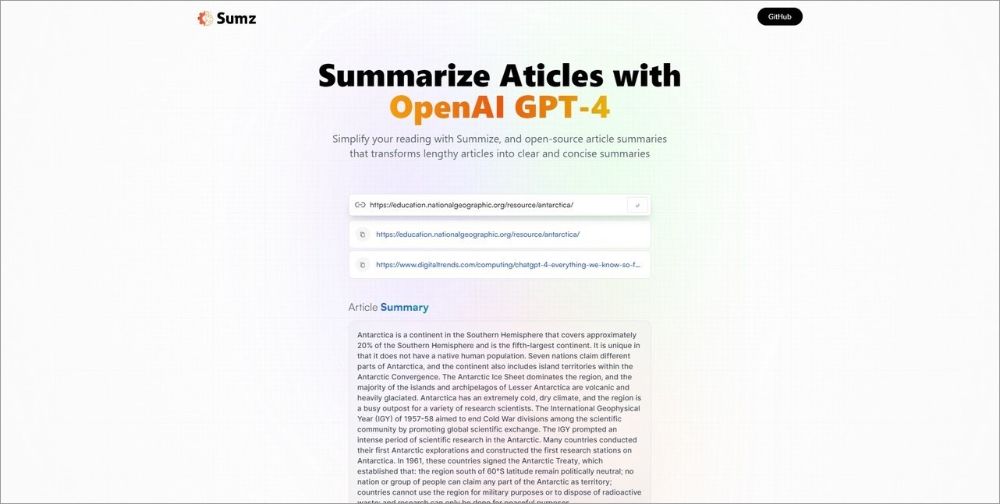

# AI Summarizer

AI Summarizer es una página web creada con React, TypeScript, Vite e implementada en Netlify. Permite a los usuarios resumir artículos en inglés proporcionando la URL del artículo. El sitio web utiliza la API proporcionada por [Article Extractor and Summarizer](https://rapidapi.com/restyler/api/article-extractor-and-summarizer) para generar resúmenes.

## Características

- Creada con React
- TypeScript
- Vite
- Netlify
- Es una página web
- La página está en inglés
- Resume artículos en inglés mediante la URL proporcionada.
- Utiliza la API [Article Extractor and Summarizer](https://rapidapi.com/restyler/api/article-extractor-and-summarizer)

## Tecnologías principales

-  React  
-  TypeScript  
-  Vite  
-  Tailwind    
-  Redux Toolkit  
-  Rapid Api  
-  Netlify  
-  LocalStorage  

## Capturas de pantalla

Las capturas de pantalla muestran la apariencia de la página web en el escritorio:

## Créditos

Este proyecto fue creado a partir de un video tutorial de JavaScript Mastery llamado "Build and Deploy Your Own GPT AI Website with React and Turn it Into a SaaS Business ($$$)". Puedes encontrar el tutorial en el siguiente enlace: [JavaScript Mastery](https://www.youtube.com/watch?v=vpvtZZi5ZWk).

## Enlace

Puedes acceder a la página web en el siguiente enlace: [AI Summarizer](https://ai-summarizer-yha.netlify.app/)
